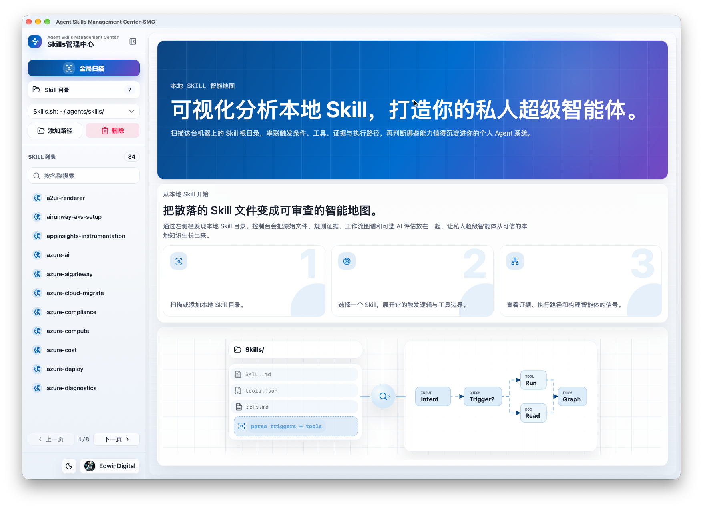
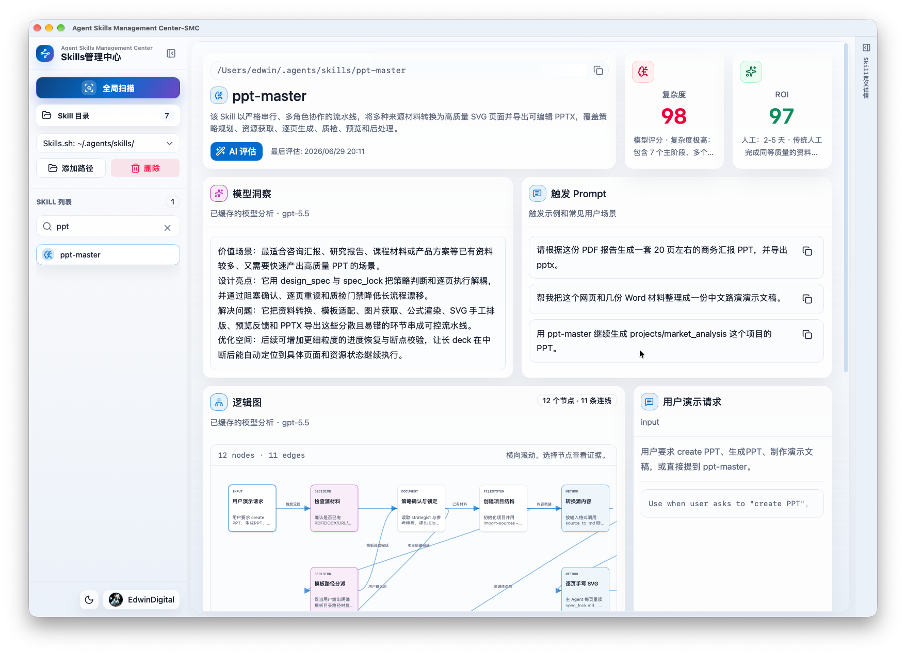
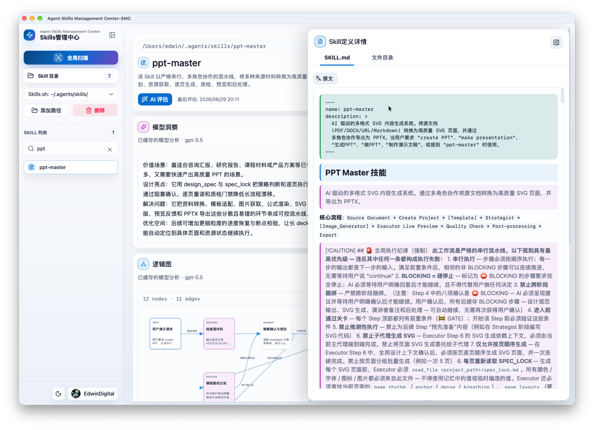
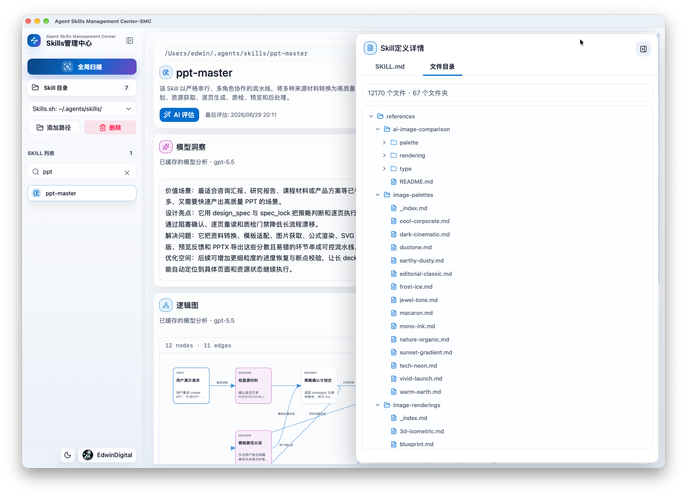
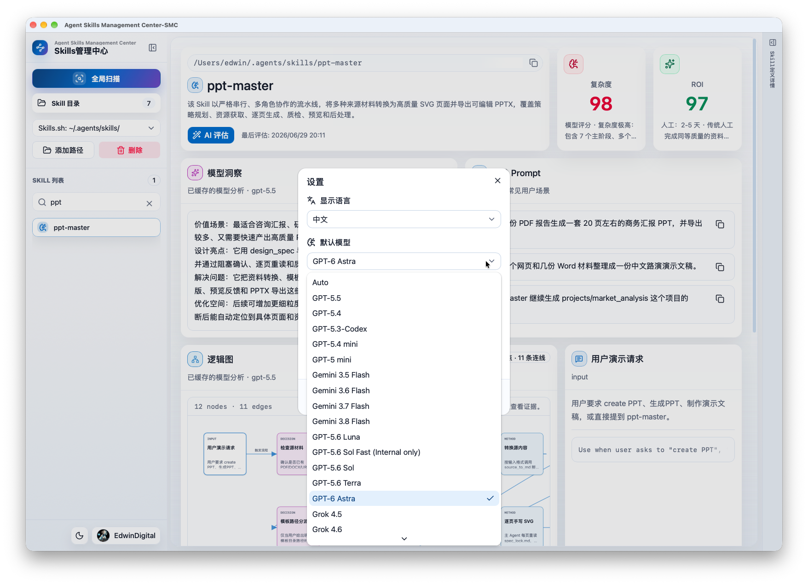

<p align="center">
  
</p>

<h1 align="center">Agent Skill Management Center</h1>

<p align="center"><strong>A local-first workbench for discovering, auditing, translating, and AI-evaluating Agent Skills.</strong></p>

<p align="center">
  <a href="README-CN.md">中文</a> ·
  <a href="docs/README.md">Documentation</a> ·
  <a href="https://github.com/EdwinDigital/agent-skill-management-center/releases/tag/v1.0.0">Download v1.0.0</a>
</p>

<p align="center">
  <a href="https://github.com/EdwinDigital/agent-skill-management-center/releases/tag/v1.0.0"></a>
  <a href="https://github.com/EdwinDigital/agent-skill-management-center/actions/workflows/ci.yml"></a>
  <a href="docs/desktop-release.md"></a>
  <a href="LICENSE"></a>
</p>



Agent SMC turns scattered local Skill folders into an auditable registry. It shows immediate rule evidence without a model call, then uses GitHub Copilot SDK on demand for complexity/ROI scores, insights, activation prompts, logic graphs, and Skill.md translation.

## Why Agent SMC

- **Local first** — scan known Skill locations or add custom roots; metadata and caches stay in local SQLite.
- **Evidence before AI** — inspect triggers, tools, files, run methods, and graph evidence immediately.
- **AI when useful** — run model-backed evaluation and translation only when requested.
- **Built for large Skill sets** — search, pagination, file trees, Markdown reading, and cache-aware workflows.
- **Desktop ready** — Tauri packages embed Node.js for macOS ARM64, Windows x64, and Windows ARM64.

## Download

| Platform | Package |
| --- | --- |
| Apple silicon, macOS 12+ | [Agent-SMC-1.0.0-macos-arm64.dmg](https://github.com/EdwinDigital/agent-skill-management-center/releases/download/v1.0.0/Agent-SMC-1.0.0-macos-arm64.dmg) |
| Intel/AMD Windows | [Agent-SMC-1.0.0-windows-x64-setup.exe](https://github.com/EdwinDigital/agent-skill-management-center/releases/download/v1.0.0/Agent-SMC-1.0.0-windows-x64-setup.exe) |
| Windows on ARM | [Agent-SMC-1.0.0-windows-arm64-setup.exe](https://github.com/EdwinDigital/agent-skill-management-center/releases/download/v1.0.0/Agent-SMC-1.0.0-windows-arm64-setup.exe) |
| Integrity | [SHA256SUMS.txt](https://github.com/EdwinDigital/agent-skill-management-center/releases/download/v1.0.0/SHA256SUMS.txt) |

The macOS package is ad-hoc signed but not notarized. Windows installers are unsigned and may trigger SmartScreen. Verify the checksum before approving an operating-system warning. See the [desktop release guide](docs/desktop-release.md).

## Product Tour

<p align="center">
  
  
</p>
<p align="center">
  
  
</p>

## Quick Start from Source

Requires Node.js 22+ with `node:sqlite`; CI and desktop bundles use Node.js 24.

```bash
git clone https://github.com/EdwinDigital/agent-skill-management-center.git
cd agent-skill-management-center
npm install
npm start
```

Open `http://localhost:4173`, run **Global scan**, and select a Skill. For live Copilot features in web mode:

```bash
gh auth login --web
gh auth refresh --scopes copilot
```

Desktop builds support GitHub Device OAuth and do not require GitHub CLI.

## Development Commands

```bash
npm test          # Node contract and runtime tests
npm run check     # server syntax + TypeScript
npm run build     # Vite production build
npm run dev       # Vite dev server; run node server.js separately
npm run desktop:dev
```

See the [development guide](docs/development.md) for Rust/Tauri checks and desktop builds.

## Documentation

| Topic | English | 中文 |
| --- | --- | --- |
| Product model and data | [Overview](docs/overview.md) | [产品概览](docs/overview-CN.md) |
| Runtime and flows | [Architecture](docs/architecture.md) | [技术架构](docs/architecture-CN.md) |
| Endpoints and configuration | [API reference](docs/api-reference.md) | [API 参考](docs/api-reference-CN.md) |
| Local development | [Development](docs/development.md) | [开发指南](docs/development-CN.md) |
| Installers and automation | [Desktop release](docs/desktop-release.md) | [桌面发布](docs/desktop-release-CN.md) |
| Common problems | [Troubleshooting](docs/troubleshooting.md) | [故障排查](docs/troubleshooting-CN.md) |

Browse the complete [documentation index](docs/README.md).

## Community

- Contributions: [CONTRIBUTING.md](CONTRIBUTING.md)
- Security reports: [SECURITY.md](SECURITY.md)
- Support: [SUPPORT.md](SUPPORT.md)
- Code of conduct: [CODE_OF_CONDUCT.md](CODE_OF_CONDUCT.md)
- Changes: [CHANGELOG.md](CHANGELOG.md)

## License

Released under the [MIT License](LICENSE).
